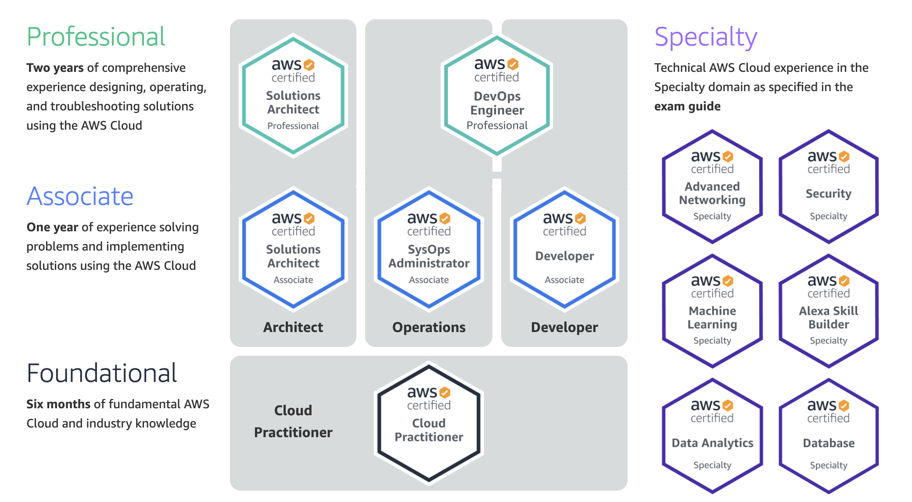

## Overview

While the COVID-19 world pandemic is currently taking place, I thought I would stay productive instead of rewatching Breaking Bad for the fourth time. I decided to obtain some [AWS  certifications](https://aws.amazon.com/certification/).

You might ask why? I think they are a fantastic way to  demonstrate expertise to employers and will absolutely help you with one's career goals. They’re also a great way to stay relevant even if you stay with the same employer.

There are many AWS certifications one could obtain but considering this was my first, I thought I would start off with a [Developer Associate Certification](https://aws.amazon.com/certification/certified-developer-associate/). This is apart of the Associate tier and expects basic knowledge of AWS  environment and tools. This post will briefly go over how I prepared for the certification exam and what you can expect.

## Preparation
Prior to doing any prepping for the exam, I must preface by saying I have been using AWS in my day to day job for over a year now and I think practical experience is very important to succeeding. The hands-on experience with AWS definitely solidified my understanding on the harder to grasp concepts and technologies.

For my studying I used [Stephane Maarek's AWS courses on Udemy](https://www.udemy.com/user/stephane-maarek/) to go over all the topics of the exam. He is very thorough and it can get quite time consuming so I watched his videos at 1.5x speed. In addition to the single practice exam at the end of the course, I purchased Stephane's additional practice exams for extra practice questions.

There is also an active community on [r/AWSCertifications](https://www.reddit.com/r/AWSCertifications) and I strongly encourage you to check out what other people have said about their experience obtaining AWS certifications.

## What to expect

As I mentioned, I took the exam during the Covid-19 pandemic so all in person test centers were closed. Instead, I took the exam virtually. The earliest exam date I was able to schedule was about two weeks in advanced. The exam is proctored virtually and you'll be required to show your work space to prove your surroundings would not allow you to cheat.

I'm not sure what specifics I can and cannot discuss about the actual questions on the exam. By the time you read this, the exam questions might have changed entirely so I would recommend checking the latest posts on [r/AWSCertifications](https://www.reddit.com/r/AWSCertifications) about what topics are on the exam.

I can confidently say, there are no trick questions on the exam and by logical reasoning you should be able to use process of elimination questions that you are uncertain about. You are given ample time to complete all 65 questions and you should definitely review your answers before submitting.

You are notified if you passed or failed immediately after submitting the exam. The passing mark for Associate exams should be 720/1000. You will be emailed your percentage grade a couple days later, but you will not be able to see which questions you got wrong or right (AWS does not want their questions to be shared publicly and distributed).

## What's next?
I received a mark of 870/1000 and truly enjoyed learning about AWS technologies I don't use on a day to day basis. I want to get at least one Professional level Certificate and eventually one Speciality Certificate. If you have any recommendations on which AWS Certificate to go for or perhaps even another cloud provider like Azure or GCP, I'd love to hear your opinion.
