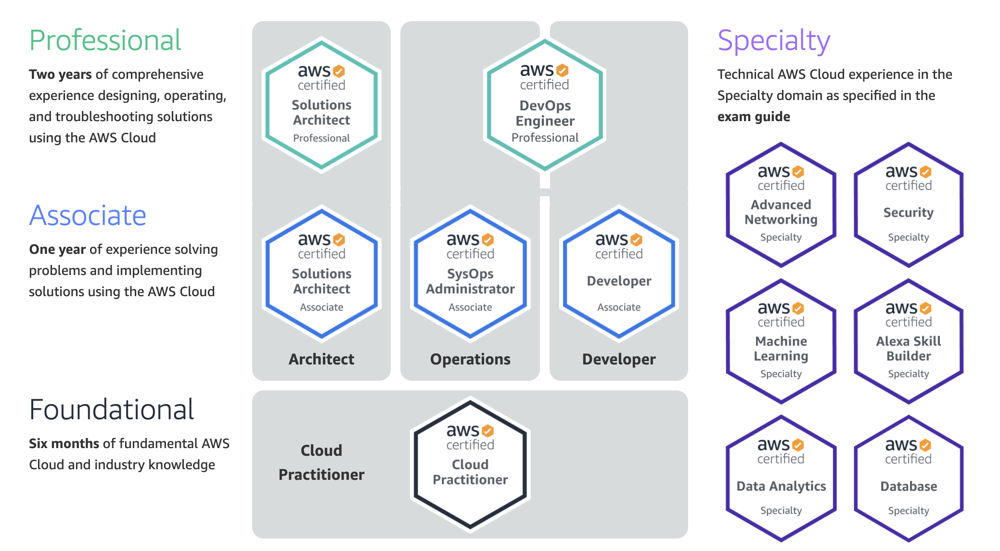

## Overview

If you read my last blog post, you know I have been working on obtaining some [AWS certifications](https://aws.amazon.com/certification/). This time around, I decided to obtain I the [Solutions Architect Associate](https://aws.amazon.com/certification/certified-solutions-architect-associate/) (SAA-C02). This post will briefly go over how I prepared for the certification exam and what you can expect.

## Preparation
Studying for this exam was very similar to studying for my previous AWS Certificate. I used [Stephane Maarek's AWS courses on Udemy](https://www.udemy.com/user/stephane-maarek/) to go over all the topics of the exam. Again, I watching his videos at 1.5x speed and  purchased Stephane's additional practice exams for extra practice questions. There was many concepts that overlapped for the DVA certificate and the SAA certificate so I was able to skip some concepts which I already studied for previously.

Based on some feedback from [r/AWSCertifications](https://www.reddit.com/r/AWSCertifications), I also purchased additional practice tests from [Jon Bonso](https://www.udemy.com/user/jonjonbonso/). Jon's practice tests differe from Stephane's practice tests in that the questions and answers would be worded more closely to how they would on the exam. Of course, one would only know this after taking both practice tests and the actual exam but thanks to the community on Reddit, I found this out before taking the actual exam.

If I were to recommend a golden path, I would recommend completing Stephane's course but then practicing with Jon's practice tests.

## What to expect

In my opinion, the SAA certificate covers a wider range of topics than the DVA certificate. Because of this I recall questioning myself during the exam several times. SAA-C02 is a revised version of the Solutions Architect Certificate and includes more modern solutions. That being said, there should be no trick questions and as long as you read the questions and answers carefully you should pass no problem. I often used process the elimination to determine what the correction answer was.

## What's next?
As I mentioned in my previous post, I want to get at least one Professional level Certificate and eventually one Speciality Certificate. The next best option for me would probably be the [Solutions Architect - Professional](https://aws.amazon.com/certification/certified-solutions-architect-professional/). If you have any recommendations on which AWS Certificate to go for or perhaps even another cloud provider like Azure or GCP, I'd love to hear your opinion.
